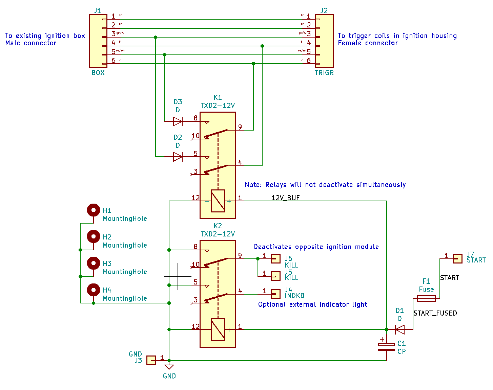
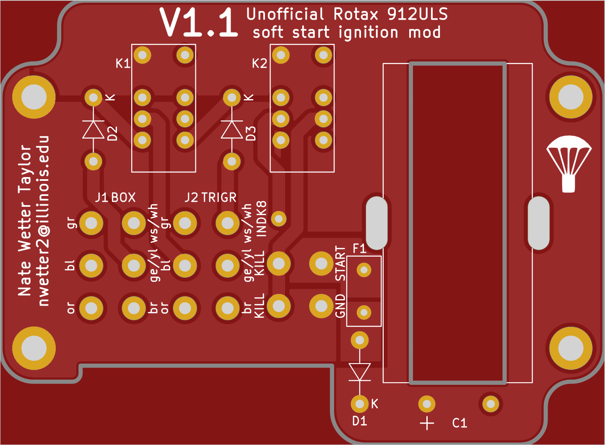
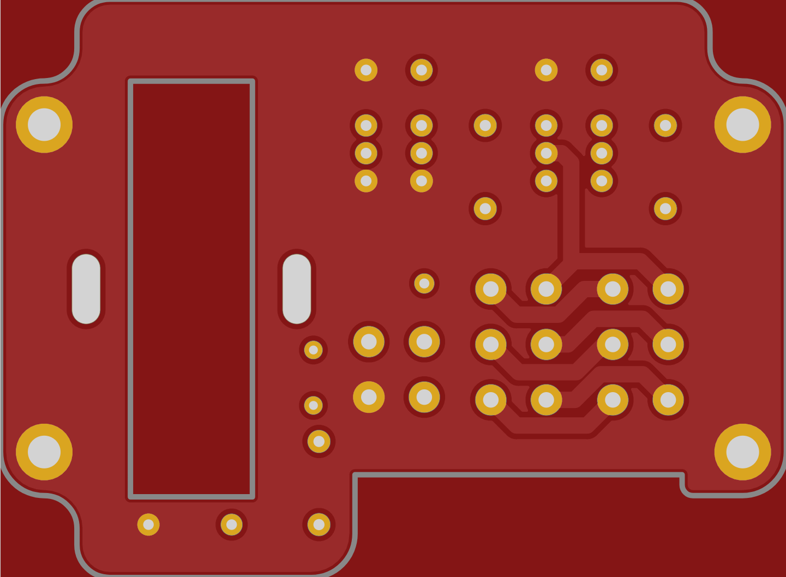
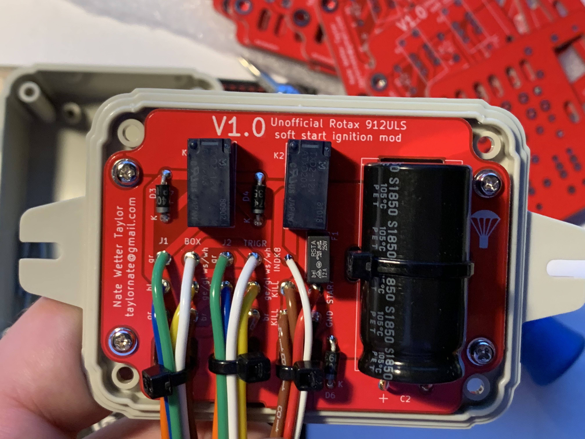
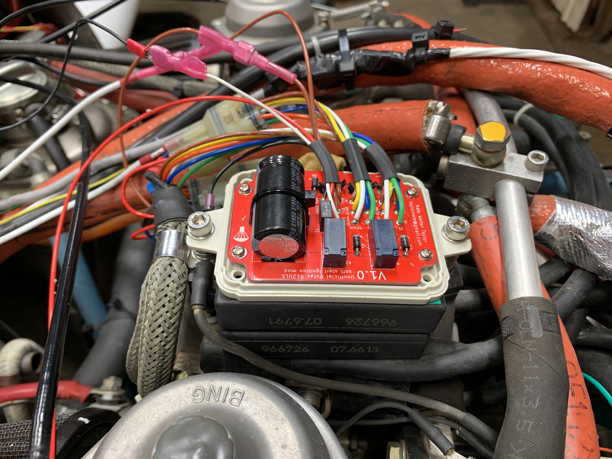
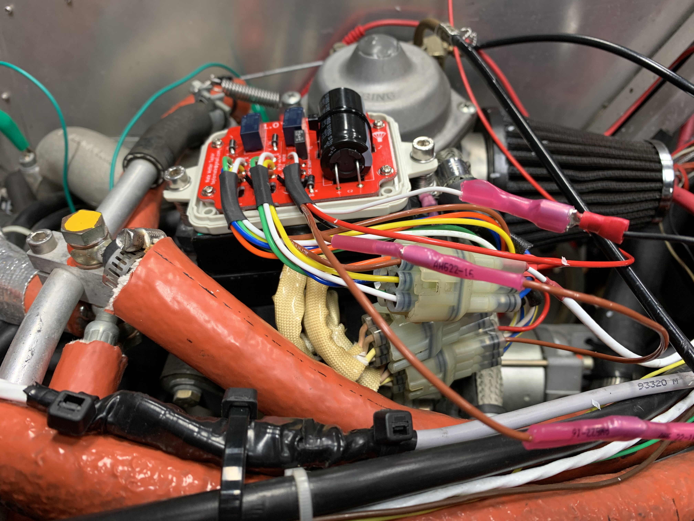
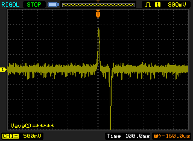
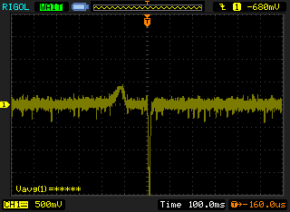

# rotax_912_soft_start
Soft start ignition module for Rotax 900 series engines

All parts [listed in BOM](https://github.com/nwetter2/rotax_912_soft_start/blob/master/BOM.pdf).

Older versions of the Rotax 900 series engines are prone to kickback on starting, which is violent and damaging to the engine. This project, inspired by a similar project by [Turbo-Tom at Rotary Wing Forums](https://www.rotaryforum.com/threads/soft-start-unit-for-rotax-912uls.23381/), improves the issue by ensuring retarded timings are used during start. It accomplishes this by using a relay to introduce a diode in parallel with the timing coil, which filters out the advanced timing pulse, which is opposite the polarity of the retarded timing pulse. Note that Turbo-Tom's design indroduces the diode in series with the coil, and this did not work in testing by this project.

The design is quite simple and uses through-hole components to ease construction. It uses the same connectors as the Rotax ignition system, so one can simply unplug one ignition module and insert the soft start module between it and the timing coils. Then, the disable wire of the opposite ignition module is connected, allowing the unmodified ignition circuit to be disabled during start. The mod is also connected to the starter relay and this is what engages the relays during start. A capacitor keeps the relays engaged for 3-8 seconds after starting. Lastly, there is an optional connection for an external indicator, which will be connected to ground while the module is active and left floating when not.

The enclosure is bolted to the top of the existing ignition modules, using longer M5 bolts and washers. The enclosure needs to be modified to accept the larger diameter bolts, and holes added for the wires to pass through. It is recommended to waterproof the pcb after assembly, using the silicone conformal coat listed in the BOM. Loctite 221 or 222 should be used on the mounting bolts.

## Schematic

## Front

## Back

## Assembled
V1.0; no cover

# Installed
V1.0; no cover

# Before
Signal from the timing coil with the soft start module unengaged

# After
Signal from the timing coil with the soft start module engaged

